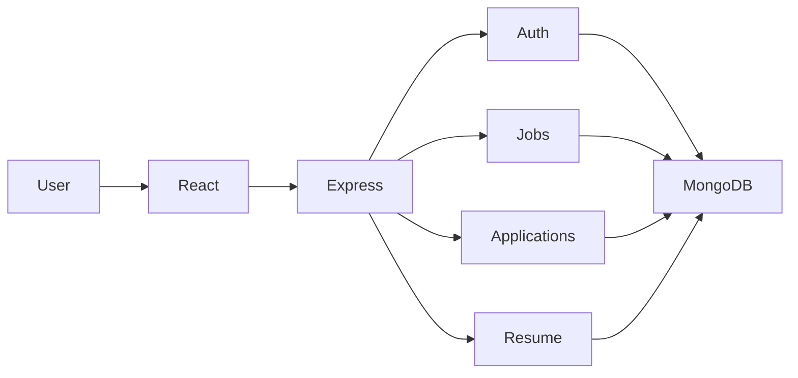
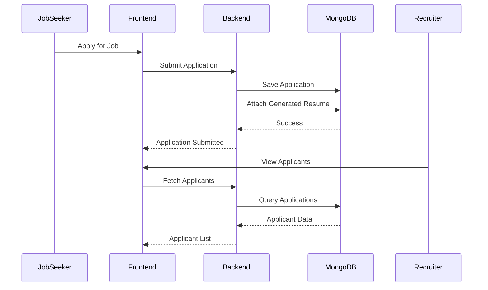

---
title: HireCrowd
description: MERN-based job portal with recruiter ATS, resume generation, and application tracking.
featured: true
status: Completed
year: 2024
role:
  - Full Stack Developer
tech:
  - React
  - Node.js
  - Express
  - MongoDB
  - TailwindCSS
  - TanStack Query
github: https://github.com/AmitxParmar/job-portal-mern
demo: https://job-portal-mern-sigma.vercel.app/
cover: /projects/job-portal/index.png
---

# HireCrowd

## Overview

HireCrowd is a full-stack hiring platform that connects job seekers with recruiters through a unified application workflow.

Job seekers can discover jobs, bookmark opportunities, generate resumes from their profiles, and track application progress. Recruiters can create job postings, review candidates, and manage hiring pipelines from a centralized dashboard.

The goal was to create a complete hiring experience while maintaining a simple and scalable MERN architecture.

## Highlights

- Job discovery and search
- Resume generation from user profile
- One-click job applications
- Recruiter job management dashboard
- Applicant Tracking System (ATS)
- Bookmark jobs
- Role-based access control
- JWT authentication
- API rate limiting
- TanStack Query caching

## Tech Stack

| Category | Technology |
|----------|------------|
| Frontend | React |
| Styling | TailwindCSS |
| Backend | Node.js, Express |
| Database | MongoDB |
| State Management | TanStack Query |
| Authentication | JWT |
| Security | RBAC, Rate Limiting |

## Architecture



## Job Application Flow



## Key Features

### Job Seekers

- Browse available jobs
- Search and filter opportunities
- Bookmark jobs
- Generate resume from profile data
- Apply directly using generated resume
- Track application status

### Recruiters

- Create job postings
- Manage active jobs
- Review applicants
- Update candidate status
- Track hiring pipeline

## UI / UX Focus

### Simplified Job Application

Users can create a profile once and generate a resume automatically.

Instead of repeatedly uploading documents, applications can be submitted directly from the platform.

### Faster Job Discovery

- Infinite scrolling
- Cached API responses
- Reduced loading states
- Optimized filtering experience

### Recruiter Workflow

The ATS dashboard helps recruiters move candidates through hiring stages without leaving the platform.

Typical flow:

```txt
Applied
↓
Under Review
↓
Interview
↓
Selected / Rejected
```

## Engineering Decisions

### TanStack Query

Used for:

- API response caching
- Background refetching
- Loading state management
- Reduced duplicate network requests

Result:

- Faster page navigation
- Better perceived performance
- Lower backend load

### Rate Limiting

Implemented Express rate limiting to protect authentication and application endpoints from abuse.

Benefits:

- Reduced spam submissions
- Improved API stability
- Better security posture

### JWT + RBAC

Implemented role-based authorization for:

- Recruiters
- Job Seekers

Protected routes ensure users only access permitted resources.

## Challenges

### Efficient Job Feed

**Problem**

Large job lists caused unnecessary API requests and re-renders.

**Solution**

Implemented TanStack Query caching with optimized pagination and query invalidation.

**Outcome**

Reduced redundant requests and improved browsing performance.

### Resume-Based Applications

**Problem**

Users had to upload resumes repeatedly for every application.

**Solution**

Built a profile-driven resume generator and attached generated resumes automatically during job applications.

**Outcome**

Reduced friction in the application process.

## Engineering Impact

### Frontend

- Reduced duplicate API requests using TanStack Query caching
- Faster page transitions through cached server state
- Improved perceived performance with optimistic UI patterns
- Better component reuse through modular architecture
- Reduced unnecessary re-renders through query-driven state management

### Backend

- Secure JWT authentication
- Role-based access control
- Rate limiting for abuse prevention
- Centralized validation and middleware
- Scalable REST API architecture

## Project Structure

```txt
client/
├── public/
└── src/
    ├── assets/
    ├── components/
    ├── constants/
    ├── hooks/
    ├── lib/
    ├── pages/
    ├── ProtectedRoutes/
    └── services/

backend/
├── config/
├── controllers/
├── db/
├── middleware/
├── models/
├── routes/
├── utils/
└── index.js
```

## Lessons Learned

- Building complete user journeys is more important than adding features.
- Server-state management significantly improves frontend performance.
- RBAC should be planned early in the architecture.
- Small UX improvements can dramatically reduce user friction.
- Modular folder structures make long-term maintenance easier.

## Repository

GitHub: https://github.com/AmitxParmar/job-portal-mern

## Demo

Live: https://job-portal-mern-sigma.vercel.app/